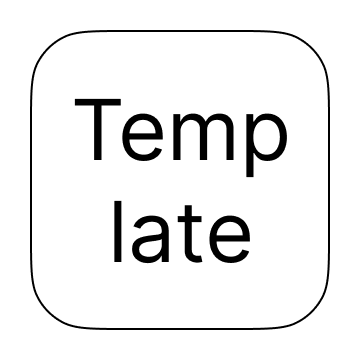

# iPhone App AppTemplate / アプリテンプレート

<!-- Manually sync below text between "/README.md(here)" and "Localizable.strings" and "AppStoreConnect/_/Description". -->
## 📓 Description

### Target / Use-case

### Option

### Others

### Background

## 🌏 Localization: All
- English

- Japanese(native)

## 🧰 Source code link
https://github.com/FlipByBlink/❓

### Source code (Mirror) link
https://gitlab.com/FlipByBlink/❓_Mirror

## ✉️ Contact
sear_pandora_0x@icloud.com

<!-- URL "Support page for AppStore" -->
<!-- https://flipbyblink.github.io/❓/ -->
<!-- URL "Privacy Policy for AppStore" -->
<!-- https://flipbyblink.github.io/❓/#privacy-policy-for-appstore -->

 
 

---

 
 
 
 

## Privacy Policy for AppStore
2022-❓-❓

### Japanese
このアプリ自身において、ユーザーの情報を一切収集しません。

### English
This application don't collect user infomation.

 
 
 
 

---

 
 
